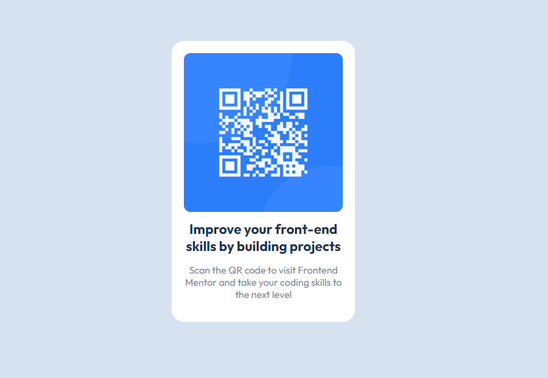

# General Information

- This is the first self-developed application as part of learning web development
- This is a solution to the [QR code component challenge on Frontend Mentor](https://www.frontendmentor.io/challenges/qr-code-component-iux_sIO_H).
- Challenge name: QR code component solution

## Table of contents

- [Overview](#overview)
  - [Screenshot](#screenshot)
- [My process](#my-process)
  - [Built with](#built-with)
  - [What I learned](#what-i-learned)
- [Author](#author)

**Note: Delete this note and update the table of contents based on what sections you keep.**

## Overview

### Screenshot

## My process

### Built with

- Semantic HTML5 markup
- CSS custom properties
- Flexbox
- Mobile-first workflow

### What I learned

- I checked the basics of html and css styles in action.
- I checked Flexbox in action

## Author

- Frontend Mentor - [@PeterTk72](https://www.frontendmentor.io/profile/PeterTk72)
- Twitter - [@ptkaczew](https://www.twitter.com/ptkaczew)
